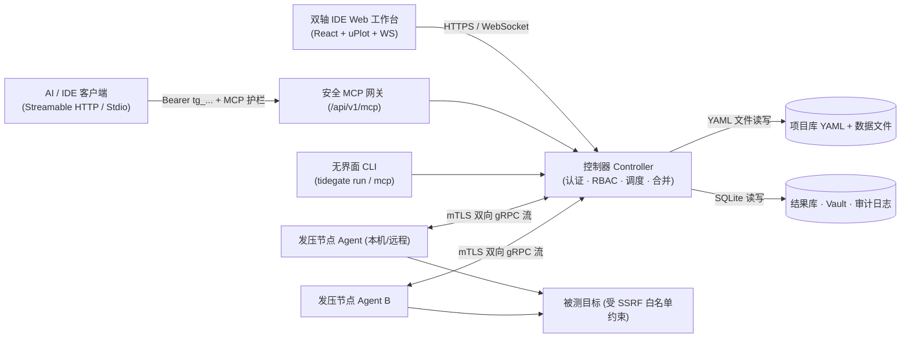

# Tidegate 产品架构与功能白皮书

版本：v1.0 正式版　更新日期：2026-11-22

## 1. 一句话定位

Tidegate 是一个本地优先、可离线单文件部署的 API 调试与分布式压测一体化控制台：在同一个双轴 IDE 工作台里完成多协议接口定义、五段耗时调试、复杂控制流场景编排，随后直接调度单机或多机零信任 mTLS 集群发起压测，通过 HDR 直方图与硬件双层遥测精准定位瓶颈，并通过安全受控的 MCP（Model Context Protocol）协议向 AI 助手开放只读诊断与护栏保护下的自动化编排。

---

## 2. 解决的核心痛点

| 现有痛点 | 根因 | Tidegate 的架构方案 |
| :--- | :--- | :--- |
| 压测时界面卡顿、内存暴涨 | 传统工具界面与发压线程同进程且每请求渲染 | 控制面与发压引擎彻底进程隔离；引擎按 Go 协程运行，仅每秒上报聚合 HDR 直方图与少量采样 |
| 接口管理与压测工具割裂 | 调试工具重交互、压测工具重 CLI，接口需维护两份 | 目录树与 YAML 接口定义作为唯一数据源，接口更新后场景与压测配置自动同步引用 |
| 分不清服务端瓶颈还是发压机瓶颈 | 仅展示表面 QPS，忽略发压机 NIC 带宽与宿主机资源 | 同步采集应用层流量与操作系统网卡速率/CPU/内存/临时端口，饱和时自动实时告警并标注不可信区间 |
| 单机上行或端口受限难以扩展 | 缺少原生分布式协议或部署过于笨重 | 内置零信任 ECDSA CA 与双向 mTLS gRPC 集群，一条命令加入节点，原生支持权重、标签筛选与掉线重平衡 |
| AI 工具接入接口平台存在密钥与生产冲垮风险 | 缺乏细粒度 RBAC 脱敏与并发硬护栏 | 内置纯 Go 安全 MCP 网关：强制 Vault 密钥零出域、RBAC 读写隔离、SSRF 白名单校验、200 VUs / 300s 默认硬护栏与全量审计 |

---

## 3. 核心设计原则

1. **热路径零阻塞**：引擎运行前将变量模板、提取器与控制流预编译为确定性执行计划，热路径复用对象缓冲且无锁统计 HDR 直方图。
2. **界面永不阻塞发压**：即使发压节点 CPU/网卡打满，Web 控制台与操作响应依旧保持流畅。
3. **单机即单节点集群**：默认 `serve` 自动监督本机 `agent` 进程，单机压测与多机分布式压测共享完全一致的调度与直方图合并路径。
4. **安全内建（Security by Default）**：所有资源零外部 CDN/字体外联（严格 `default-src 'self'` CSP）、AES-256-GCM 敏感变量保险箱、RBAC 角色控制、出站目标白名单与全链路审计日志默认集成。
5. **本地优先与开放互通**：项目数据以标准 YAML 文件落盘，可直接纳入 Git；完整支持 OpenAPI 3 / Swagger 2 / Postman / Apifox / JMeter / HAR / cURL / k6 导入导出。

---

## 4. 总体架构

```mermaid
flowchart LR
    UI["双轴 IDE Web 工作台\n(React + uPlot + WS)"] -- HTTPS / WebSocket --> C["控制器 Controller\n(认证 · RBAC · 调度 · 合并)"]
    AI["AI / IDE 客户端\n(Streamable HTTP / Stdio)"] -- "Bearer tg_... + MCP 护栏" --> MCP["安全 MCP 网关 (/api/v1/mcp)"]
    MCP --> C
    CLI["无界面 CLI\n(tidegate run / mcp)"] --> C
    C -- YAML 文件读写 --> P[("项目库 YAML + 数据文件")]
    C -- SQLite 读写 --> R[("结果库 · Vault · 审计日志")]
    A1["发压节点 Agent (本机/远程)"] <-- "mTLS 双向 gRPC 流" --> C
    A2["发压节点 Agent B"] <-- "mTLS 双向 gRPC 流" --> C
    A1 --> T["被测目标 (受 SSRF 白名单约束)"]
    A2 --> T
```

单一原生二进制内置六种运行角色：

| 命令 | 角色 | 说明 |
| :--- | :--- | :--- |
| `tidegate serve`（默认） | 控制台 + 控制器 + 本机发压节点 + MCP HTTP 端点 | 启动完整控制台并自动监督本机 `agent` 子进程；支持 `--tls-self-signed` 与反代模式 |
| `tidegate agent` | 分布式发压节点 | 通过一次性 Join Token 与 `--ca-fingerprint` 完成双向 mTLS 注册，并可凭 `--cert-dir` 免密续连 |
| `tidegate mcp` | 本地 CLI Stdio MCP 代理 | 将 `stdin`/`stdout` JSON-RPC 2.0 安全桥接至运行中的 Tidegate 服务 |
| `tidegate run <场景文件>` | 无界面压测与 CI 门禁 | 支持导出 JSON/CSV/HTML/JTL，SLA 阈值违约时以退出码 `3` 中止流水线 |
| `tidegate reset-password` | 管理员密码重置 | 离线运维命令，安全重置指定用户密码并轮换会话 |
| `tidegate testserver` | 内置高性能被测靶场 | 提供 HTTP / WS / gRPC / SSE 基准与回归测试端点 |

---

## 5. 功能模块全景（已全面交付）

### 5.1 双轴 IDE 工作台与接口管理
- **应用骨架**：深海潮闸蓝可折叠导航栏（`SidebarRail`）+ 44px 单行上下文顶栏（含激活环境 `BaseURL` 预览胶囊与后台运行态迷你遥测胶囊）+ `Ctrl+K / ⌘K` 原生 `<dialog>` 全局命令与接口检索面板。
- **可拖拽分屏工作台**：支持**左右并排**（宽屏默认）与**上下分屏**实时切换，支持鼠标拖拽与键盘方向键精确调节比例并自动记忆偏好。
- **多协议调试与定义**：支持 **HTTP/1.1、HTTP/2、WebSocket、gRPC Unary、SSE**；内置路径/查询参数、请求头继承、多形态请求体（JSON/表单/Multipart/Raw/二进制文件）、鉴权（Bearer / Basic / API Key / OAuth 2.0 Client Credentials）、XPath / JSONPath / 正则提取器、JSON Schema 断言与 OpenAPI 响应示例/字段文档。
- **五段耗时瀑布与调试历史**：每次单次调试捕获 DNS、TCP 建连、TLS 握手、首字节（TTFB）及下载耗时分布，调试历史落盘前自动强制脱敏 Vault 密文与认证请求头。
- **四级变量与 Vault**：支持项目、环境、场景及会话临时变量池四级覆写与 `{{func}}` 动态内置函数；`Secret: true` 变量由独立主密钥以 AES-256-GCM 分域加密存储，不进入导出归档与明文日志。

### 5.2 场景编排与确定性发压引擎
- **流程控制与纯 Go 脚本沙箱**：支持事务分组（`group`）、计数/条件循环（`loop`）、分支判断（`if`）、加权分流（`weighted`）及纯 Go 受限 AST 脚本步骤（`script`，管理员可全局禁用）。
- **数据驱动与混合流量**：支持 CSV / JSON / JSONL 参数化数据文件与跨分布式节点分片（`slice`）；支持多场景加权混合（`Mix`）、思考时间（固定/均匀/正态分布）与自定义代理/DNS 覆写。
- **双负载模型与 SLA 阈值**：支持闭环并发（VUs）与开环固定速率（RPS），多阶段（预热/爬坡/稳态/退坡）编排；支持运行期在线调压与开压前吞吐/带宽容量预估；SLA 阈值违约支持自动中止并生成诊断结果。

### 5.3 实时可观测、HDR 统计与报告对比
- **实时多维大盘**：1Hz 聚合推送，内置 `uPlot` 吞吐量、延迟分位（P50/P90/P95/P99/Max）、错误率、并发、双层带宽及告警区间高亮。
- **深度延迟剖面**：基于精确 HDR 直方图实现跨节点无损归并，支持 12 段耗时分布柱状图、时间×延迟分桶热力图与异常请求一键工作台复现。
- **对比与可观测导出**：支持 2–6 次历史压测叠加与基线回归分析；内置 Prometheus 采集端点（`/api/v1/metrics/prometheus`）、InfluxDB v1/v2 与 Prometheus Pushgateway 异步实时外推（带防云元数据 SSRF Dial 校验），并支持导出离线单文件 HTML、CSV、JSON、HAR 1.2 与 JMeter JTL。

### 5.4 多format 导入导出生态
- **两步预览安全导入**：先预览创建/更新/跳过差异diff与转换告警再确认入库，支持 `.tidegate` 归档、OpenAPI 3.x / Swagger 2.0、Postman Collection v2.1（含环境）、Apifox、HAR 1.2、JMeter `.jmx` 与 cURL 命令。
- **全面生态导出**：支持导出 `.tidegate` 完整归档、OpenAPI 3.0 JSON/YAML（含示例与响应字段文档）、Postman v2.1 与 **k6 JavaScript 压测脚本**（密文变量保留模板占位不泄露）。

### 5.5 零信任分布式 mTLS 集群
- **零信任自建 CA**：控制器自动生成 ECDSA P-256 集群 CA，通过一次性/限时 Join Token + `--ca-fingerprint` SHA-256 指纹完成发压节点 CSR 换签与双向 mTLS 认证。
- **证书持久化与节点治理**：支持 `--cert-dir` 节点证书自动续连、危险节点在线吊销隔离、节点标签筛选（`node_selector`）、自定义权重按比例分流及 `redistribute` / `abort` 节点掉线容错策略。

### 5.6 安全与多角色企业治理
- **账号与凭证**：首次启动一次性初始化口令、Argon2id 抗暴力破解存储、多端会话列举与踢出、`HttpOnly + SameSite=Strict` 会话及带权限上限与 IP 限流的长期 `tg_` Bearer 令牌。
- **RBAC 与护栏**：`admin`（系统与用户治理）/ `member`（编辑、调试与受控压测）/ `viewer`（只读查看）；支持出站域名/IP/CIDR 目标白名单（防重绑定拨号校验）、成员 VUs/RPS 配额、全局脚本禁令与 `audit_logs` 操作审计。

---

## 6. MCP 智能体安全协议接入（Model Context Protocol）

Tidegate 内置无外部依赖的纯 Go MCP 服务端，兼容 Claude Desktop、Cursor、Antigravity 等主流 MCP 宿主客户端：

1. **双模式传输**：
   - **Streamable HTTP**：`POST /api/v1/mcp`（遵循 MCP `2025-06-18` / `2025-03-26` JSON-RPC 2.0，使用 `Authorization: Bearer tg_...` 认证，无凭证探测规范返回 `401`）。
   - **CLI Stdio 代理**：`tidegate mcp --url <URL> --token tg_...`（所有日志写往 `stderr`，`stdout` 保持纯净 JSON-RPC 行帧）。
2. **15 个高内聚工具矩阵（全部标注安全 Annotations）**：
   - **只读探查与诊断（`viewer` 及以上可用，`readOnlyHint: true`）**：`list_projects`、`get_project_workspace`、`get_api_detail`、`get_scenario_detail`、`estimate_load_run`、`list_runs`、`get_run_report`、`compare_runs`、`get_cluster_status`。
   - **编排与导入（`member` 及以上可用）**：`save_api`、`import_api_spec`（支持 `preview`/`apply`）、`save_scenario`。
   - **受控调试与压测（`member` 及以上可用，`openWorldHint: true`）**：`debug_api`、`debug_scenario`、`manage_load_run`（`start`/`set_target`/`graceful_stop`/`abort`）。
3. **六层纵深安全防线**：
   - 管理员策略开关（`mcp_disabled` 总开关、`mcp_disable_load_runs` 禁止 AI 发起压测）；
   - RBAC 令牌作用域拦截（`viewer` 令牌无法触发任何写/调试/压测工具）；
   - 强制零密钥出域（`IncludeSecrets=false` + `RedactSecrets=true` + 敏感头掩码）；
   - 出站 SSRF 白名单与 `scripts_disabled` 透传校验；
   - 默认单次压测硬护栏（默认上限 **200 VUs / 300 秒**，防止误调度超大规模流量）、请求 `1 MiB` 与响应 `48 KiB` 截断、单 actor 120 req/min 限流；
   - 全量 MCP 调用写入 `audit_logs`（`action: "mcp.tool.<name>"`）。

---

## 7. 技术选型与性能指标

| 层级 | 技术栈选型 | 说明 |
| :--- | :--- | :--- |
| 核心引擎与控制器 | **Go 1.26+**（`CGO_ENABLED=0` 静态编译） | 自研高性能 HTTP/1.1 引擎 + HTTP/2 / WebSocket / gRPC / SSE 客户端；纯 Go AST 脚本沙箱 |
| 界面前端 | **React 18 + TypeScript + Tailwind CSS v4 + uPlot** | 自研精密测控台设计令牌与双轴 IDE 分屏工作台，构建产物通过 `go:embed` 内嵌二进制 |
| 存储与直方图 | YAML 项目目录 + 纯 Go SQLite (`modernc.org/sqlite`) + HDR 直方图 | 支持 AES-256-GCM 主密钥保险箱与跨节点直方图合并 |
| 容器与跨平台 | 多阶段静态镜像（非 root + 只读根文件系统） | 原生支持 Windows、Linux、macOS |
